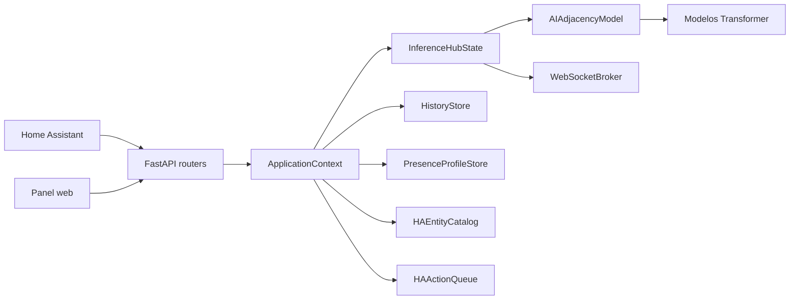

# Arquitectura del sistema

## Componentes

### Modelo de inferencia

`inferencia_hub/ai_model.py` publica `AIAdjacencyModel`. Sus capacidades se
encuentran en `inferencia_hub/ai/`:

- `model.py`: inicialización y composición del modelo.
- `persistence.py`: serialización y recuperación de estados entrenados.
- `transitions.py`: lectura de eventos, transiciones y predicción de habitación.
- `simulation.py`: perfiles de actividad y generación de eventos sintéticos.
- `occupancy.py`: entrenamiento y predicción de ocupación.
- `graph.py`: inferencia y validación del grafo de adyacencia.
- `training.py`: coordinación del entrenamiento desde CSV.

Estos componentes dependen de contratos y reglas del dominio, pero no conocen
FastAPI ni el estado de la aplicación.

### Aplicación FastAPI

`inferencia_hub/application.py` crea la aplicación, registra su ciclo de vida,
los routers y los recursos estáticos. Los controladores están organizados en
`inferencia_hub/runtime/`:

- `shared.py`: contexto y dependencias compartidas.
- `lifecycle.py`: carga, persistencia, inicio y cierre.
- `presence.py`: ingesta, consultas, modos y WebSocket.
- `history.py`: configuración y consultas históricas.
- `home_assistant.py`: catálogo, sensores y acciones de Home Assistant.
- `profiles.py`: CRUD, activación, migración y modelos aislados por perfil.
- `layout.py`: escenarios, mapa de referencia y métricas.
- `training.py`: entrenamiento y artefactos.
- `replay.py`: carga, ejecución y control de reproducciones.

`runtime.HANDLERS` relaciona los controladores con los routers definidos en
`inferencia_hub/api/`.

### Estado de inferencia

`inferencia_hub/hub_state.py` publica `InferenceHubState`. Sus operaciones están
organizadas en `inferencia_hub/hub/`:

- `state.py`: inicialización del estado.
- `layout.py`: habitaciones, mapa de referencia y adyacencia.
- `sensors.py`: configuración y asignación de sensores reales.
- `metrics.py`: estimación de personas, calidad, alertas y latencia.
- `filtering.py`: filtro temporal y reglas de desplazamiento.
- `inference.py`: creencia probabilística, inferencia y transiciones.
- `events.py`: procesamiento completo de eventos.
- `snapshot.py`: snapshots, reinicio y publicación.
- `profiles.py`: aplica habitaciones, entidades y conexiones al núcleo.

`server.py` publica la aplicación ASGI. Cada módulo de `api/` declara sus rutas,
métodos, etiquetas y resúmenes. `ApplicationContext`, almacenado en
`app.state.context`, administra los servicios de infraestructura.

El núcleo `InferenceHubState` publica eventos mediante una función asíncrona y
`WebSocketBroker` entrega esos eventos a las conexiones activas. El catálogo de
Home Assistant mantiene un índice por `entity_id`, por lo que la validación y
resolución de nombres se realizan en tiempo constante.

## Dependencias permitidas

- `api` depende de contratos y controladores.
- `runtime` coordina servicios, persistencia y operaciones del núcleo.
- `hub` depende de reglas del dominio y modelos, pero no de FastAPI.
- `ai` depende de reglas del dominio, NumPy y bibliotecas de entrenamiento.
- Persistencia y transporte no importan algoritmos de entrenamiento.
- El frontend utiliza módulos ES sin dependencias externas.

`panel/main.js` inicia el panel y `panel/orchestrator.js` coordina sus
controladores. Las funciones de interfaz se distribuyen entre `dashboard.js`,
`realtime.js`, `home-assistant.js`, `history.js`, `replay-training.js`,
`map.js`, `modal.js`, `profiles.js`, `profile-api.js`, `profile-events.js`,
`profile-mutations.js`, `profile-entities.js`, `profile-view.js`,
`profile-preview.js` y `profile-draft.js`.

## Flujo de un evento

1. HACS normaliza el cambio de estado y lo envía a `/api/events`.
2. El controlador valida el perfil activo, la fuente, el modo y el catálogo.
3. `InferenceHubState.process_event` actualiza presencia, mapa y métricas.
4. El evento se envía a la cola SQLite y a las conexiones WebSocket.
5. HACS aplica la respuesta a las entidades nativas de Home Assistant.

## Contratos públicos

El backend publica las rutas `/api/*`, el WebSocket `/presencia`, los payloads
de inferencia y el punto ASGI `server:app`. La configuración utiliza variables
de entorno y el historial persistente mantiene su esquema mediante migraciones
de SQLite.
